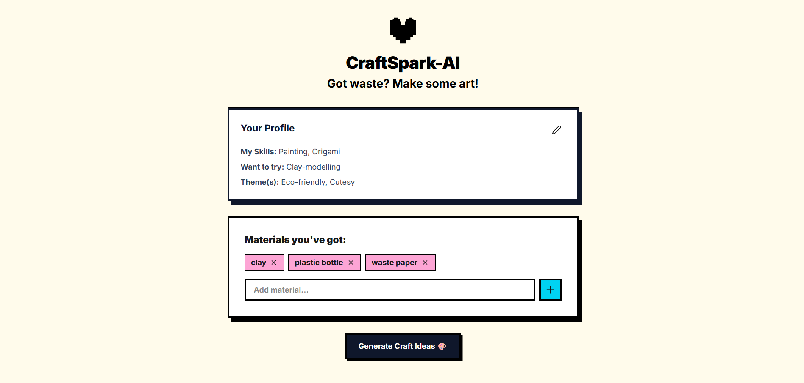
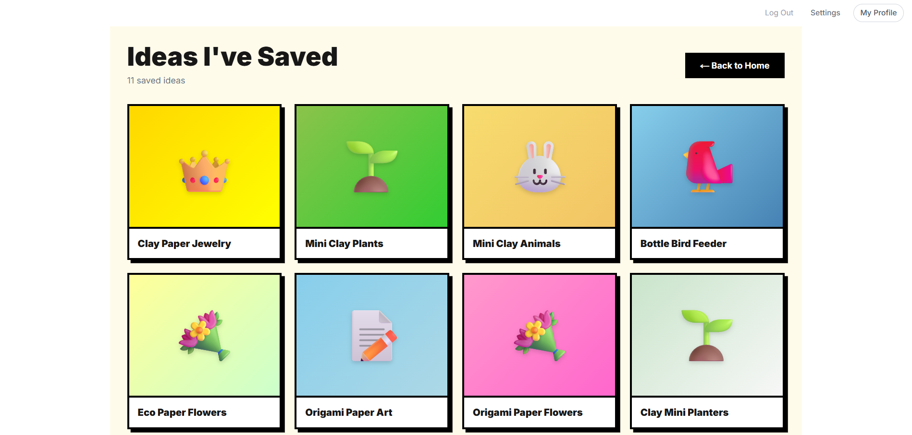

# CraftSpark-AI

An art and DIY craft idea generator powered by AI. Discover creative projects based on your skillset and recyclable materials. Got waste? Recycle it into beautiful art.

## Tech Stack

[](https://react.dev)
[](https://nextjs.org)
[](https://tailwindcss.com/)
[](https://nodejs.org)
[](https://expressjs.com)
[](https://www.mongodb.com)

## Features

- AI-powered craft suggestion engine tailored to your materials and skills.
- Custom JWT-based authentication system.
- Direct inline saving of crafts to your personal inspiration board.
- Dynamic Bento Box UI with AI-generated gradients and emojis.
- Manage your account securely with full data deletion capabilities.

## Preview

### Home Page Generation


### Saved Ideas Profile


## Status

Currently using the Groq API (LLaMA 3) for fast AI generation. User authentication and craft saving are fully integrated with MongoDB.

--- 

## Server Execution Guide

**1. Install Dependencies**

```bash
cd CraftSpark-AI
npm install
```

**2. Configure Environment Variables**

Create a `.env` file in the root directory and add the following keys:

```bash
GROQ_API_KEY=your_groq_api_key_here
MONGODB_URI=mongodb://localhost:27017/craftspark
JWT_SECRET=your_secure_jwt_secret_here
```

**3. Run the Development Server**

The project uses `concurrently` to run both the Node backend and Next.js frontend simultaneously.

```bash
npm run dev
```
